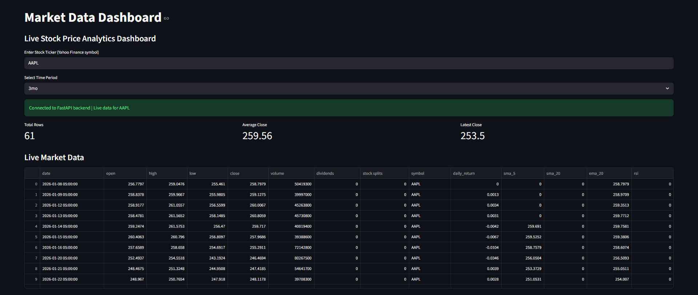
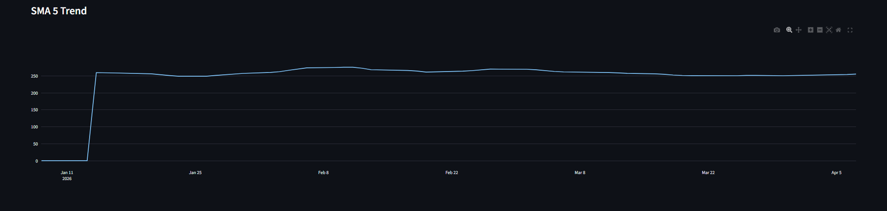

# Market Data ETL Dashboard

## Project Overview

A production-style stock market analytics platform that ingests live market data from Yahoo Finance, processes it through an ETL pipeline, stores it in SQLite, serves it through FastAPI APIs, and visualizes insights using an interactive Streamlit dashboard.

This project was built to understand how real-world data moves from ingestion to storage, APIs, and dashboards in an end-to-end data engineering workflow.

---

## Features

- Yahoo Finance live stock search
- End-to-end ETL pipeline
- Automated data cleaning and transformation
- SQLite database storage
- FastAPI REST API
- Interactive Streamlit dashboard
- Technical indicators (SMA, EMA, RSI)
- Candlestick charts
- Volume analysis
- Swagger API documentation
- Scheduled data updates

---

## Tech Stack

- Python
- FastAPI
- Streamlit
- Pandas
- Plotly
- SQLite
- SQLAlchemy
- APScheduler
- yfinance

---

## Screenshots

### Dashboard Overview



### Candlestick and Volume Analysis


### SMA Trend



---

## How to Run

### Clone Repository

```bash
git clone https://github.com/csumitwr/market-data-etl-dashboard.git
cd market-data-etl-dashboard
```

### Create Virtual Environment

```bash
python -m venv venv
```

### Activate Virtual Environment

```bash
venv\Scripts\activate
```

### Install Dependencies

```bash
pip install -r requirements.txt
```

### Start FastAPI Backend

```bash
uvicorn api.main:app --reload
```

### Start Streamlit Dashboard

```bash
streamlit run dashboard/app.py
```

---

## Project Architecture

```text
Yahoo Finance
      │
      ▼
 Data Ingestion
      │
      ▼
 Data Transformation
      │
      ▼
 SQLite Database
      │
      ▼
    FastAPI
      │
      ▼
  Streamlit UI
```

---

## What I Learned

- Building production-style ETL pipelines
- Integrating external APIs using yfinance
- Designing REST APIs with FastAPI
- Working with SQLite and SQLAlchemy
- Creating interactive dashboards with Streamlit
- Visualizing financial data using Plotly
- Implementing technical indicators for financial analysis
- Structuring scalable Python projects
- Connecting ingestion, transformation, storage, APIs, and visualization into a complete workflow

---

## Future Improvements

- LLM-powered stock summaries
- Multi-stock comparison dashboard
- Portfolio tracking
- Price alerts and notifications
- Docker containerization
- PostgreSQL migration
- Cloud deployment
- User authentication

---

## License

This project is licensed under the MIT License.